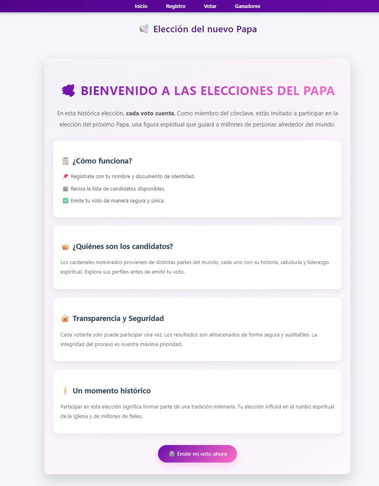
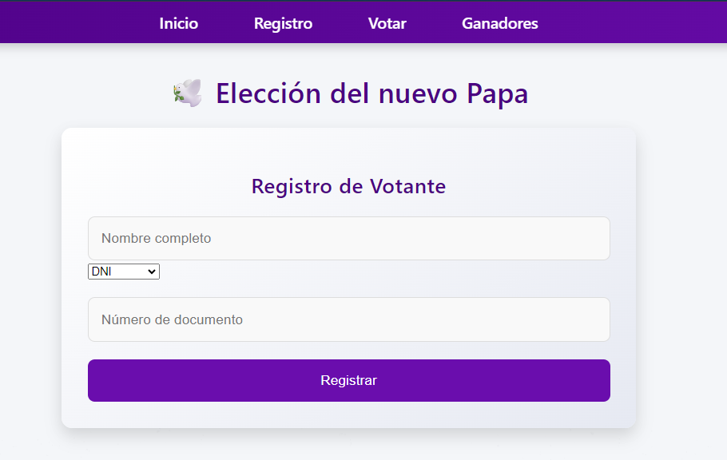
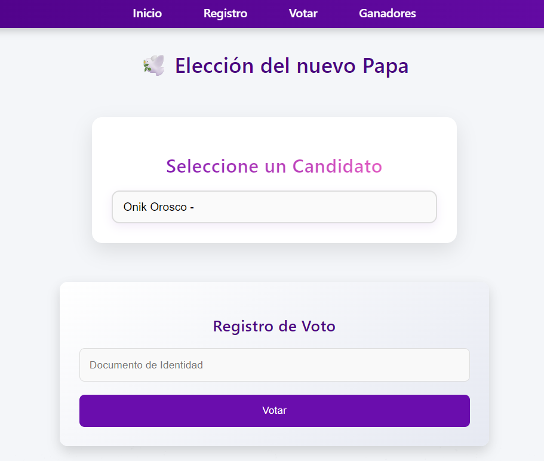
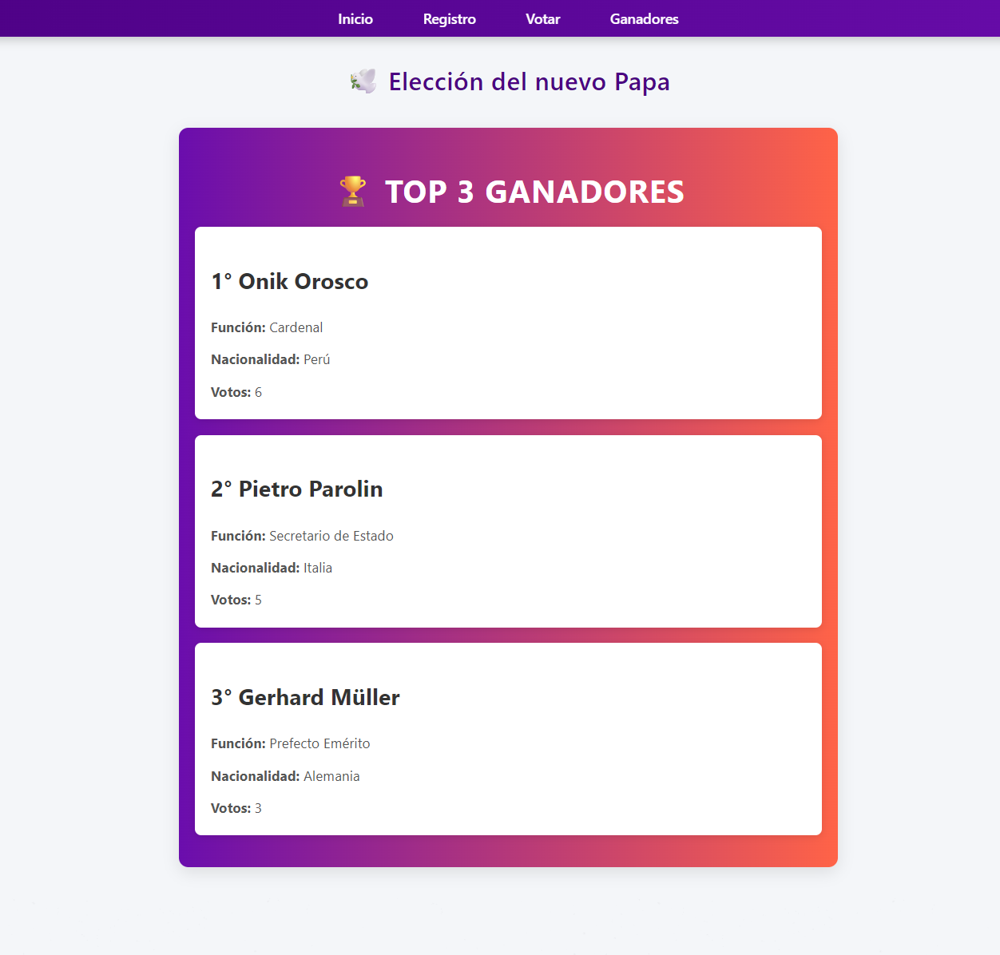

# 🕊️ Papal Election System

A modern full-stack web application for simulating a papal election, where users can register, view candidates, and cast their votes securely. This system replicates the spirit of the traditional conclave with transparency and digital integrity.

## 🚀 Features

- 🗳️ Secure and unique voting system
- 👤 Voter registration with ID verification
- 📋 Real-time list of papal candidates
- 👑 Display of top 3 elected candidates
- 📊 Transparent and auditable results
- 🎨 Beautiful and responsive UI with React & TailwindCSS
- 🌐 Backend powered by Node.js, Express, and MongoDB

## 🏗️ Technologies Used

- Frontend: React, TailwindCSS
- Backend: Node.js, Express
- Database: MongoDB with Mongoose
- HTTP Requests: Axios


## ⚙️ Installation

1. **Clone the repository**
```bash
git clone https://github.com/onikorosco7/papal-election-system.git
```

2. **Navigate to the project**
```bash
cd papal-election-system
```

3. **Install dependencies**
```bash
cd backend && npm install
cd frontend && npm install
```

4. **Create `.env` file in `/server`**
```env
MONGODB_URI=your_mongodb_uri
PORT=9000
```

5. **Run the app**
```bash
# In one terminal for the backend
cd backend && npm start

# In another terminal for the frontend
cd client && npm run dev
```

## 📸 Screenshots

### UI Principal


### Proceso de Registro


### Votar


### TOP 3


## 📜 License

This project is open-source and available under the MIT License.

---

Feel free to contribute or customize this project to fit other types of democratic voting systems!